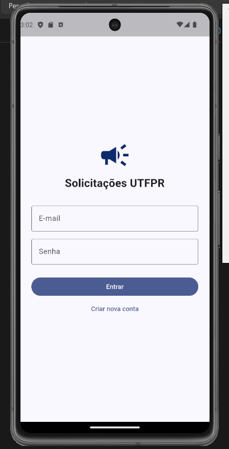
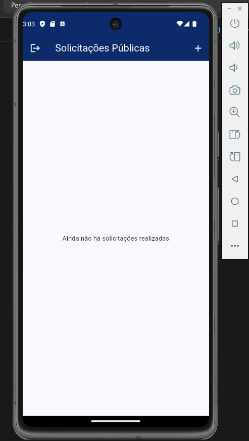
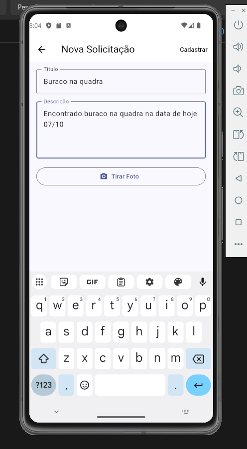
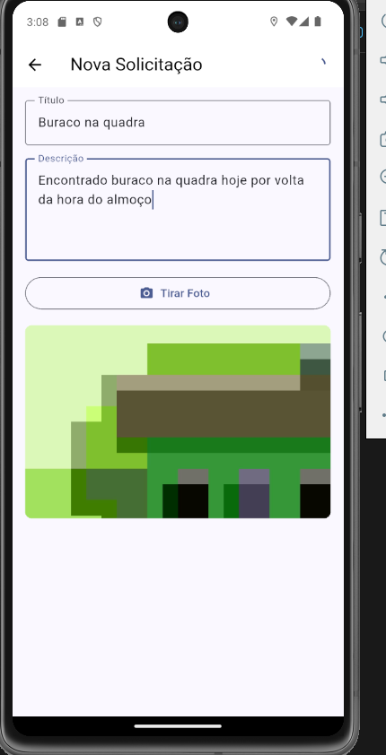
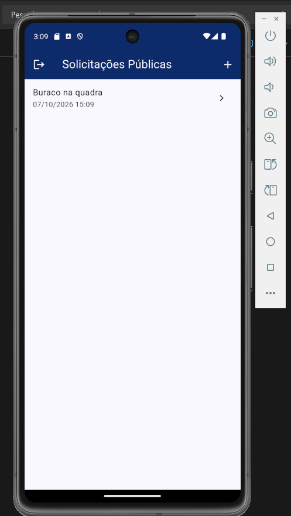
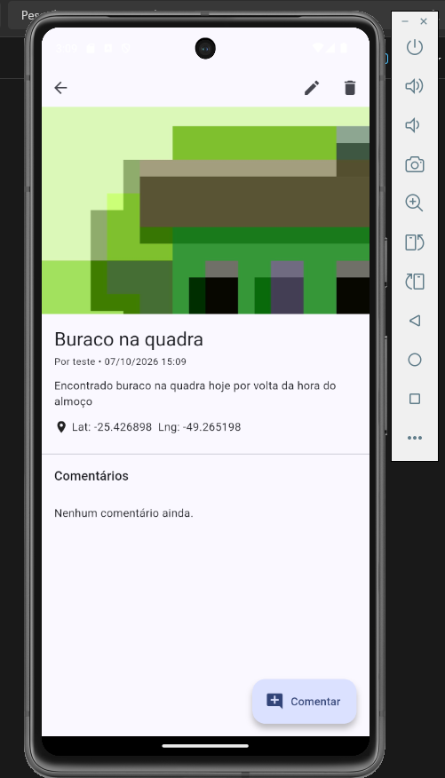
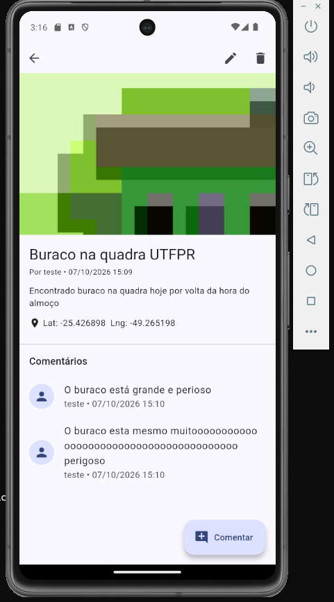
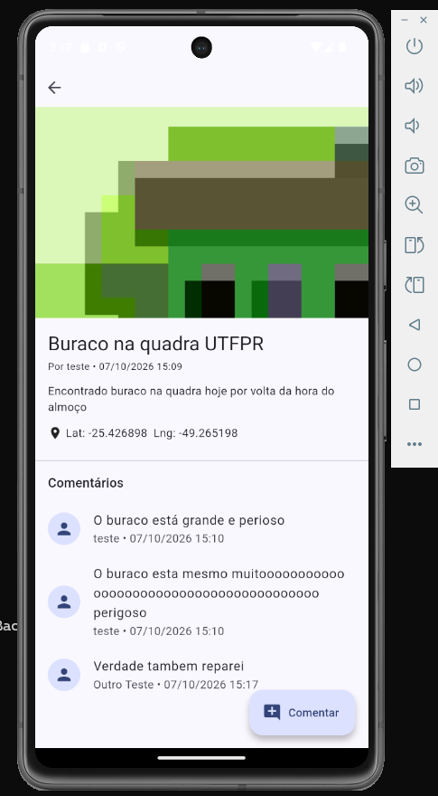

# UTFPR Solicitações

App Android (Flutter) para enviar reclamações e solicitações à central de atendimento da UTFPR.
Backend: PocketBase (autenticação, banco de dados e armazenamento das fotos).

## 1. Passos para Instalação, Configuração e Execução

**Versões testadas:** Flutter 3.47.6, Android SDK 36, NDK 30.0.16248370, emulador Pixel 7 (API 34), PocketBase 0.40.4.

1. **NDK:** o projeto usa o NDK `30.0.16248370` (definido em `android/app/build.gradle.kts`). Instale em *Android Studio > SDK Manager > SDK Tools > NDK (Side by side)*, ou troque o valor de `ndkVersion` pela versão que você já tem.
2. **PocketBase:** baixe a versão 0.40.4 (ou superior) para o seu sistema em https://pocketbase.io/docs/, extraia e, na pasta do executável, rode `pocketbase.exe serve` (Linux/Mac: `./pocketbase serve`). Deixe a janela aberta.
3. Abra o link `/_/#/pbinstal/...` mostrado no terminal e crie um usuário admin (qualquer e-mail e senha; o banco começa vazio).
4. No painel, vá em *Settings > Import collections > Load from JSON file*, escolha `pocketbase/pb_schema.json` deste repositório e confirme (*Review > Confirm and import*). Isso cria as coleções `users`, `requests` e `comments` com os campos e as regras de acesso.
5. Na raiz do projeto, rode `flutter pub get`.
6. Ligue um emulador Android e rode `flutter run`. O primeiro build demora alguns minutos.

O endereço do backend fica em `lib/config.dart` (padrão `http://10.0.2.2:8090`, para emulador). Em celular físico, use o IP do computador e inicie o PocketBase com `--http=0.0.0.0:8090`.

## 2. Dados e informações para o teste

- **Usuários de teste** (crie pelo botão "Criar nova conta", pois o banco começa vazio):
  - `teste@utfpr.edu.br` / `senha12345`
  - `outro@utfpr.edu.br` / `senha12345`
- **Admin do PocketBase:** o do passo 3, criado por você. O admin do ambiente de desenvolvimento não existe no seu banco.
- **Emulador:** antes de cadastrar uma solicitação, defina uma localização (por exemplo Curitiba) em *Extended controls (...) > Location > Set location*. A foto usa a câmera virtual (aperte o obturador e confirme). Se o Android pedir permissão de localização, aceite.
- **Teste sugerido:** crie uma solicitação com foto, comente, edite e exclua. Depois saia (ícone no canto esquerdo da tela principal), entre com o outro usuário e confirme que ele comenta, mas não vê editar nem excluir.

## 3. Outras informações relevantes

- Login persistente: o usuário continua logado ao reabrir o app.
- O ícone de sair na tela principal foi incluído para facilitar o teste com mais de um usuário.
- Permissões do Android: internet e localização (`AndroidManifest.xml`). A câmera é aberta pelo app de câmera do sistema.
- Tecnologias: Flutter, PocketBase, `image_picker`, `geolocator`, `shared_preferences`.

## 4. Capturas de tela

**Login e lista vazia**

 

**Nova solicitação**

 

**Lista e detalhes**

 

**Comentário e edição**

**Permissões (outro usuário)**

